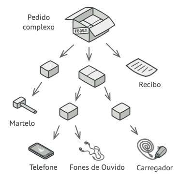

# Composite Design Pattern

Composite é um design pattern estrutural que permite compor objetos em uma estrutura semelhante a uma árvore e trabalhar com ela como se fosse um objeto singular.


### Quando usar Composite? 🤔

Usar o pattern Composite faz sentido somente quando o modelo central do seu aplicativo pode ser representado como uma árvore.

Por exemplo, imagine que você tem dois tipos de objetos: Produtos e Caixas. Uma Caixa pode conter vários Produtos, bem como várias Caixas menores. Essas pequenas Caixas também podem conter alguns Produtos ou até Caixas menores, e assim por diante.

Digamos que você decida criar um sistema de pedidos que use essas classes. Os pedidos podem conter produtos simples sem qualquer embalagem, bem como caixas cheias de produtos ... e outras caixas. Como você determinaria o preço total de tal pedido?



Você pode tentar a abordagem direta: desembrulhe todas as caixas 📦, examine todos os produtos e calcule o total. Isso seria viável no mundo real; mas em um programa, não é tão simples quanto executar um loop. Você tem que saber as classes de produtos e caixas que está passando, o nível de aninhamento das caixas e outros detalhes desagradáveis de antemão. Tudo isso torna a abordagem direta muito difícil ou mesmo impossível 😭.

### Como usar Composite? 

O padrão Composite sugere que você trabalhe com Produtos e Caixas por meio de uma interface comum que declara um método para calcular o preço total.

Como esse método funcionaria? Para um produto, seria simplesmente retornar o preço do produto. Para uma caixa, ele examinaria cada item que a caixa contém, perguntaria seu preço e, em seguida, retornaria um total para esta caixa. Se um desses itens fosse uma caixa menor, essa caixa também começaria a revisar seu conteúdo e assim por diante, até que os preços de todos os componentes internos fossem calculados. Uma caixa pode até adicionar algum custo extra ao preço final, como custo de embalagem.


O maior benefício dessa abordagem é que você não precisa se preocupar sobre as classes concretas dos objetos que compõem essa árvore. Você não precisa saber se um objeto é um produto simples ou uma caixa sofisticada. Você pode tratar todos eles com a mesma interface. Quando você chama um método os próprios objetos passam o pedido pela árvore.

###  Analogia com o mundo real 🌍

 

Exércitos da maioria dos países estão estruturados como hierarquias. Um exército consiste de diversas divisões; uma divisão é um conjunto de brigadas, e uma brigada consiste de pelotões, que podem ser divididos em esquadrões. Finalmente, um esquadrão é um pequeno grupo de soldados reais. Ordens são dadas do topo da hierarquia e são passadas abaixo para cada nível até cada soldado saber o que precisa ser feito.

###  Estrutura 🌳


- O Cliente trabalha com todos os elementos através da interface componente. Como resultado, o cliente pode trabalhar da mesma forma tanto com elementos simples como elementos complexos da árvore.

- A interface Componente descreve operações que são comuns tanto para elementos simples como para elementos complexos da árvore.

- A Folha é um elemento básico de uma árvore que não tem sub-elementos.
  
  Geralmente, componentes folha acabam fazendo boa parte do verdadeiro trabalho, uma vez que não tem mais ninguém para delegá-lo.
  
- O Contêiner (ou composite) é o elemento que tem sub-elementos: folhas ou outros contêineres. Um contêiner não sabe a classe concreta de seus filhos. Ele trabalha com todos os sub-elementos apenas através da interface componente.
  
  Ao receber um pedido, um contêiner delega o trabalho para seus sub-elementos, processa os resultados intermediários, e então retorna o resultado final para o cliente.

##### Bora ver na prática? Clique [aqui](https://github.com/GustavoSTZ/composite-pattern/tree/main/src/main/java/com/gustavostz/composite) para ir ver a pasta do código 💻.

### 👍Prós e contras👎

#### Prós👍
- Você pode trabalhar com estruturas de árvore complexas mais convenientemente: utilize o polimorfismo e a recursão a seu favor.
- Princípio aberto/fechado. Você pode introduzir novos tipos de elemento na aplicação sem quebrar o código existente, o que agora funciona com a árvore de objetos.

#### Contras👎

-  Pode ser difícil providenciar uma interface comum para classes cuja funcionalidade difere muito. Em certos cenários, você precisaria generalizar muito a interface componente, fazendo dela uma interface de difícil compreensão.

#### E ae curtiu o pattern Composite? 😎


## Instalação 🖥
Pré-requisito: Java 8+
```cmd 
git clone https://github.com/GustavoSTZ/composite-pattern.git
```

### Referência:
[](https://refactoring.guru/design-patterns/composite)

Da uma olhada na fonte original 😉
