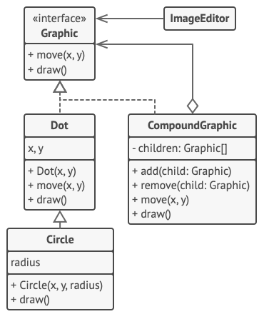

### Não entendeu e quer que eu desenhe?

Relaxa já tá desesenhado logo embaixo! 

Nesse exemplo, o padrão Composite deixa que você implemente pilhas de formas geométricas em um editor gráfico.

A classe CompoundGraphic é um contêiner que pode ter qualquer número de sub-formas, incluindo outras formas compostas. Uma forma composta tem os mesmos métodos que uma forma simples. Contudo, ao invés de fazer algo próprio, uma forma composta passa o pedido recursivamente para todas as suas filhas e “soma” o resultado.

O código cliente trabalha com todas as formas através da interface única comum à todas as classes de forma. Portanto, o cliente não sabe se está trabalhando com uma forma simples ou composta. O cliente pode trabalhar com estruturas de objeto muito complexas sem ficar acoplado à classe concreta que formou aquela estrutura.